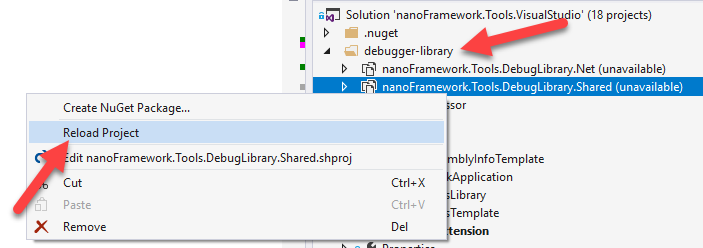

# Developer notes

## Launching  Visual Studio experimental instance

To launch Visual Studio experimental instance:

1. Open VS developer command prompt.
2. Enter `"C:\Program Files (x86)\Microsoft Visual Studio\2017\Professional\Common7\IDE\devenv.exe"  /rootSuffix Exp`

> Mind to adjust the path above to your setup.

## Reset VS experimental instance

In case you need to reset the Visual Studio experimental instance:

1. Open VS developer command prompt.
2. Navigate to `e:\Program Files (x86)\Microsoft Visual Studio\2017\Professional\VSSDK\VisualStudioIntegration\Tools\Bin`.
3. Enter `CreateExpInstance /Reset /VSInstance=15.0 /RootSuffix=_d9708c20Exp`.

> Mind to adjust the path above to your setup.
> The RootSuffix above (**_d9708c20Exp**) will be different for each installation. Please amend the above to match your local one.

You'll want to reset VS experimental instance on a number of situations. Usually this is when you need to start fresh because there is too much clutter, a failed deployment that is creeplying your debugging or whenever a new Visual Studio update is installed.

## Debugging with the **nanoFramework** Debugger library

In situations where you want to debug something in the **nanoFramework** Debugger library please follow these steps:

1. Make sure to update (or checkout the appropriate commit) in the `nf-debugger` git sub-module.
1. Load the debugger Solution and perform the "NuGet package restore". You can close it after that.
1. Load the `nanoFramework.Tools.Debugger.sln` solution there, restore the NuGets for the solution and rebuild it. After this you can close the solution.
1. Load the **nanoFramework** extension solution in Visual Studio.
1. Expand the folder `debugger-library` and find there 2 projects for each of the components.
1. Right click and hit `Reload` for each of the project there. Like this.

    

6. Use the [NuGet reference switcher extension](https://marketplace.visualstudio.com/items?itemName=RicoSuter.NuGetReferenceSwitcherforVisualStudio2017) to switch the references to `nanoFramework.Tools.Debugger` from NuGet to project and point it to the appropriate project.
1. Perform whatever debug that you need by placing breakpoint on any source file of the debugger library.
1. When you are done open the NuGet reference switcher extension again, open the Switch to NuGet references tab and revert the debugger library references. Make sure that the "remove projects from solution" is **not** checked.
1. Unload the debugger library projects from the solution.
